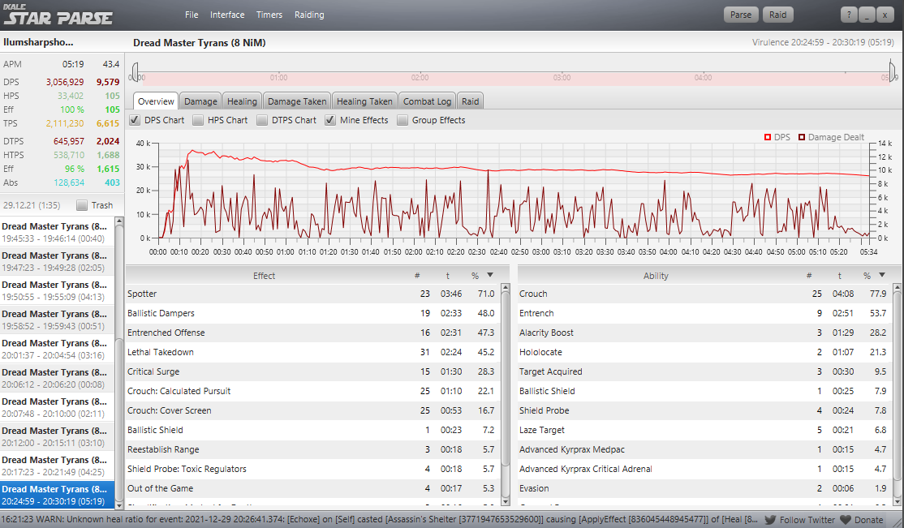
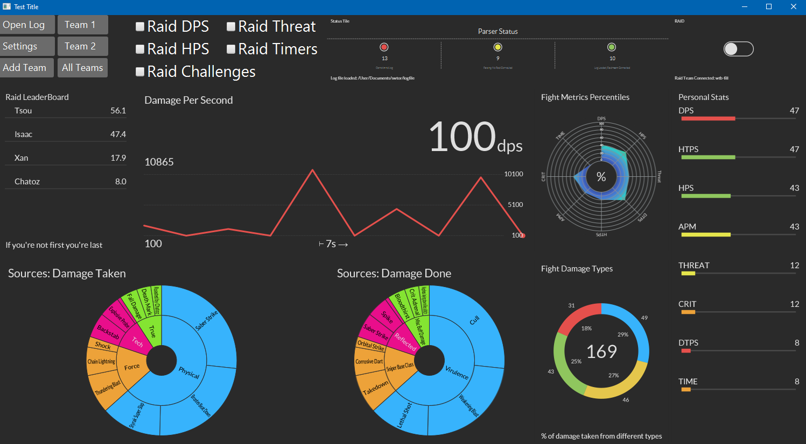

**Issue Board**
---

Summary of Next Objectives
---

### Get a rough draft UI built with Mock Data

- [x] Convert Tiles Library to Scala
- [x] Select Tiles that we may want
- [ ] Plan to Cover Current Star Parse Functionality in UI
    - [ ] Still need to add functionality to toggle between instances of combat
- [x] Put Mock Data in
    
### Parse a Complete and Static Log
- [ ] Build out types of "patterns" that combat log lines appear as
    - [ ] Figure out what order of priority these need to be handled in 
    - [ ] Cover types of logging that appear in different classes. These are likely to be near identical but they should be checked.
        - [ ] Tank
        - [ ] Dps
        - [ ] Heal
    
- [ ] Analyse log and calculate the following basic statistics:
  - [ ] In each instance of combat (UI should break these up)
    - [ ] DPS
    - [ ] HPS
    - [ ] DTPS
    - [ ] HTPS
    - [ ] Damage done by source
    - [ ] Damage received by source
    - [ ] Damage received by type
    - [ ] Time
    
- [ ] Update UI Elements with information gathered from log
    - [ ] How can we structure this in a way that will make it easy when streaming log data
    
### Parse a Live log 
- [ ] Handle automatically selecting the newest log in a directory 

- [ ] I'm guessing we will need to watch the log for updates or we can get it every second or so 

- [ ] How do we handle two programs trying to use the log at the same time?

Future Work Ideas Section
---

### Timers 

- Timer Database for everyone to upload and share custom-made timers on 

### Connect Clients

Update UI to show other peoples information
- What information do we want to send between clients?
- How should we package it and structure our code to make that easy as possible?

How do we want to connect clients together and with a database? What should we use to do this?
- Kafka consumers?
- Twitter Streams?
- Apache Streams? 

### Database 

- Maybe logs should always be put to a DB for analytics

- What type of database do we want?

### Global Statistics Engine

### Uploading Logs to a Website
- The current log website (not the cite to dowload the tool that we looked at earlier) is actually probably hit quite a bit. If we replace it with ours it might pay for coffee

ABOUT
---

The goal of this project is to redesign, modernize, and improve the SWTOR Star Parse Program. The current program is
rather old and basic. 

The current UI looks like:

It provides some bare-bones functionality. 

This Project Current Concept UI:

### Goals of this project

- Create a Modernized Parsing Tool
- Retain all current functionality 
- Add an analytics engine
  - Analyze global logs
  - Provide partial fight statistics
  - Provide feedback, tips, trends from top parses 
  - Provide percentile metrics 
  

### Skills this project will cover
---

- Scala, a hybrid functional and object oriented programing language 
- Databases 
- Datascience - Industry Standard Analytic tools and frameworks, such as Spark
- Streaming Data and Real Time Data Processing
- Infrastructure and Devops Development and Cluster Management 
- UI Design
- Possibly Web design and full stack website development 
- Small Team Software Development 
